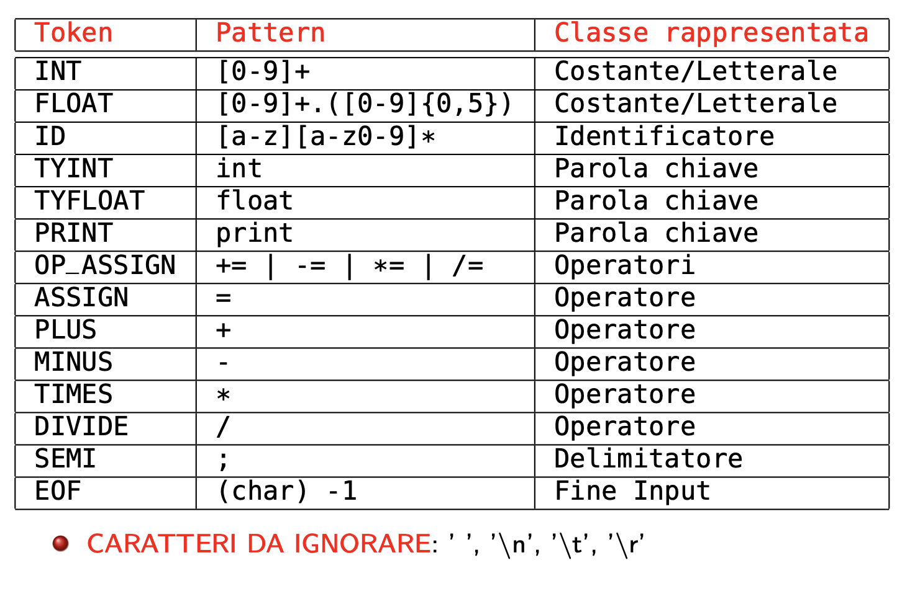
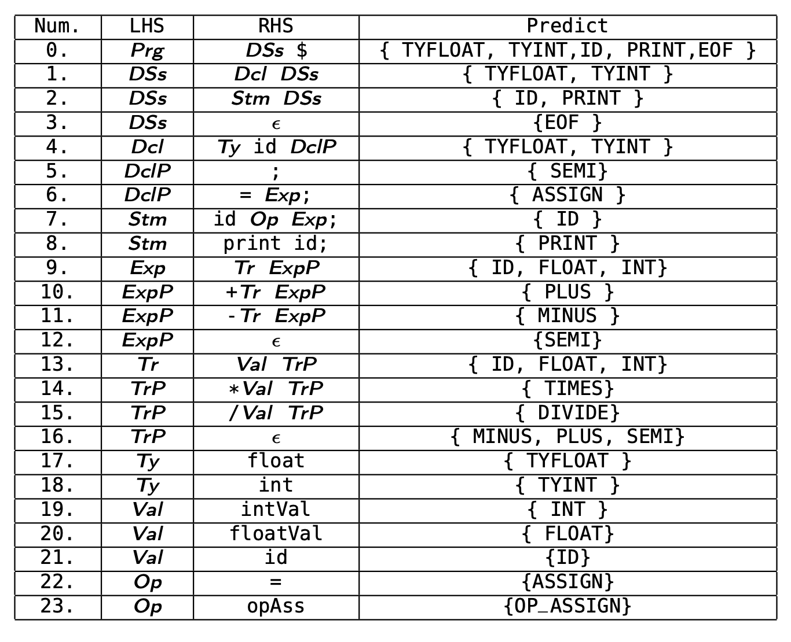

# Compilatore AcDc

[](https://www.oracle.com/java/)
[](https://junit.org/junit5/)

Un compilatore didattico per il linguaggio imperativo **AcDc**, sviluppato per comprendere le fasi fondamentali della compilazione: analisi lessicale, sintattica, semantica e generazione del codice.

---

## 📋 Panoramica

Questo progetto implementa un compilatore completo che trasforma programmi scritti nel linguaggio AcDc in codice target. È pensato a scopo didattico per illustrare in modo chiaro e accessibile il funzionamento di un compilatore.

### Esempio di codice AcDc

```acdc
int a;
float b = 3.5;
a = 10;
b += a * 2;
print b;
```

---

## 🏗️ Architettura

Il compilatore è organizzato in fasi sequenziali:

### 1. **Scanner (Analisi Lessicale)**
Legge il file sorgente carattere per carattere e produce una sequenza di token.




**Caratteristiche:**
- Riconoscimento di identificatori, parole chiave (`int`, `float`, `print`)
- Gestione di numeri interi e float (max 5 cifre decimali)
- Operatori aritmetici (`+`, `-`, `*`, `/`) e di assegnamento (`=`, `+=`, `-=`, `*=`, `/=`)
- Gestione degli errori lessicali (caratteri illegali, numeri malformati)

### 2. **Parser (Analisi Sintattica)**
Verifica che la sequenza di token rispetti la grammatica del linguaggio e costruisce l'AST (Abstract Syntax Tree).



**Caratteristiche:**
- Parsing ricorsivo discendente
- Costruzione dell'albero di sintassi astratta
- Segnalazione di errori sintattici con numero di riga

### 3. **Symbol Table**
Gestisce le dichiarazioni di variabili e i loro tipi durante l'analisi semantica.

### 4. **Type Checker (Analisi Semantica)**
Attraversa l'AST verificando la correttezza dei tipi e la coerenza delle operazioni.

**Controlli:**
- Dichiarazioni duplicate
- Uso di variabili non dichiarate
- Compatibilità dei tipi nelle operazioni

### 5. **Code Generator**
Produce codice target a partire dall'AST verificato, gestendo l'allocazione dei registri.

---

## 📁 Struttura del progetto

```
CompilatoreAcDc/
├── src/
│   ├── scanner/          # Analisi lessicale
│   ├── parser/           # Analisi sintattica
│   ├── ast/              # Nodi dell'albero di sintassi astratta
│   ├── symbolTable/      # Tabella dei simboli
│   ├── visitor/          # Type checker e code generator
│   ├── token/            # Definizioni token
│   └── test/             # Suite di test JUnit
└── doc/
    └── images/           # Diagrammi e schemi
```

---

## 🧪 Test

Il progetto include una suite completa di test JUnit per ogni componente:

- **TestScanner**: Verifica il corretto riconoscimento dei token e la gestione degli errori lessicali
- **TestParser**: Testa l'analisi sintattica su programmi corretti ed errati
- **TestTypeChecker**: Controlla l'analisi semantica e il type checking
- **TestCodeGenerator**: Valida la generazione del codice target

I test sono organizzati in modo incrementale, testando prima i componenti base e poi quelli più complessi.

---

## 🚀 Come usare

### Prerequisiti
- **Java 8** o superiore
- IDE con supporto JUnit 5 (IntelliJ IDEA, Eclipse, VS Code)

### Esecuzione
1. Importa il progetto nel tuo IDE Java
2. Assicurati che le dipendenze JUnit 5 siano configurate
3. Esegui i test dal pacchetto `src/test/` per verificare il funzionamento
4. Esplora i file di esempio in `src/test/data/` per vedere casi d'uso reali

---

